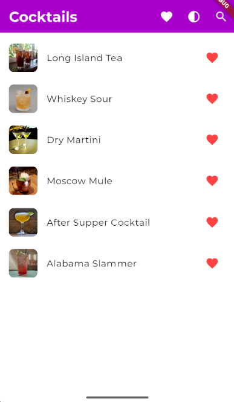
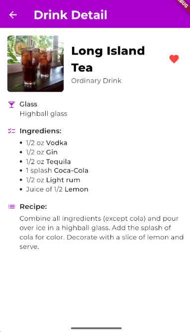

 # Drinks App

Aplikacja mobilna stworzona w Flutterze, która umożliwia użytkownikom przeglądanie, wyszukiwanie i oznaczanie drinków jako ulubione. Aplikacja korzysta z zewnętrznego API (Solvro Cocktails API) do pobierania przepisów koktajli i składników.

## Funkcjonalności

- **Lista Drinków**: Użytkownicy mogą przeglądać pełną listę dostępnych drinków z ich zdjęciem i nazwą.

- **Wyszukiwanie**: Umożliwia wyszukiwanie drinków po nazwie.

- **Ulubione Drinki**: Użytkownicy mogą oznaczać drinki jako ulubione. Status ulubionych jest zapisywany w lokalnej pamięci urządzenia.

- **Szczegóły Drinków**: Po kliknięciu w drink, użytkownik zostaje przekierowany do ekranu z szczegółowymi informacjami, takimi jak kategoria, rodzaj szkła, lista składników oraz instrukcja przygotowania.

- **Responsywność**: Aplikacja jest responsywna i dostosowuje się do różnych rozmiarów ekranów.

- **Obsługa Ciemnego Motywu**: Aplikacja obsługuje ciemny i jasny motyw.

## Technologie

- Flutter
- Dart
- API 

## Zrzuty ekranu

### Ekran główny aplikacji (motyw jasny)

### Ekran główny aplikacji (motyw ciemny)

### Filtrowanie polubionych drinków

### Szukanie drinka po nazwie

### Ekran szczegółów drinka

