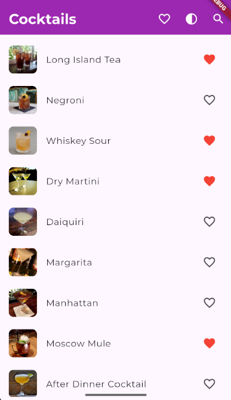
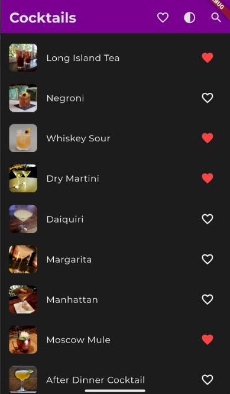

 Drinks App

## Opis aplikacji

Drinks App to aplikacja mobilna stworzona w Flutterze, która umożliwia użytkownikom przeglądanie, wyszukiwanie i oznaczanie drinków jako ulubione. Aplikacja korzysta z zewnętrznego API do pobierania przepisów koktajli i składników, co pozwala na dynamiczne wyświetlanie informacji.

## Funkcjonalności

- **Lista Drinków**: Użytkownicy mogą przeglądać pełną listę dostępnych drinków z obrazami i nazwami.

- **Wyszukiwanie**: Umożliwia wyszukiwanie drinków po nazwie, co pozwala na szybkie znajdowanie ulubionych pozycji.

- **Ulubione Drink**: Użytkownicy mogą oznaczać drinki jako ulubione, co pozwala na łatwiejszy dostęp do często wybieranych koktajli. Status ulubionych jest zapisywany w lokalnej pamięci urządzenia.

- **Szczegóły Drinków**: Po kliknięciu w drink, użytkownik zostaje przekierowany do ekranu z szczegółowymi informacjami, takimi jak kategoria, rodzaj szkła, jego składniki i instrukcje przygotowania.

- **Responsywność**: Aplikacja jest responsywna i dostosowuje się do różnych rozmiarów ekranów, w tym telefonów i tabletów.

- **Obsługa Ciemnego Motywu**: Aplikacja obsługuje ciemny i jasny motyw, które można przełączać w ustawieniach.

## Technologie

- Flutter
- Dart
- API do drinków
- Shared Preferences

## Instalacja

1. Sklonuj repozytorium.
2. Uruchom `flutter pub get`, aby zainstalować wymagane pakiety.
3. Uruchom aplikację używając `flutter run`.

## Zrzuty ekranu

